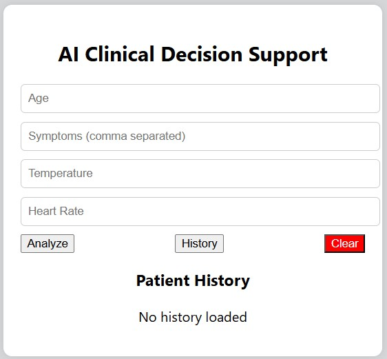
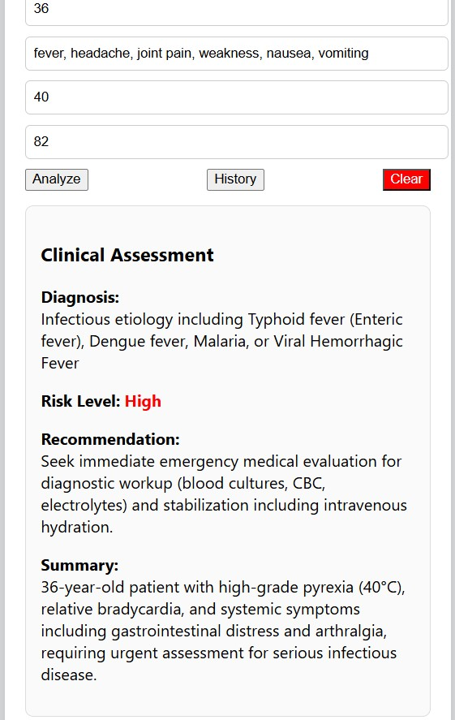
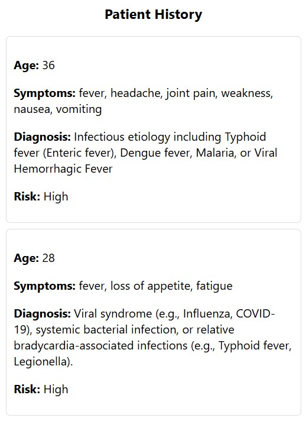

# 🏥 AI Clinical Decision Support System

## 🌐 Live Demo
👉 https://ai-clinical-decision-support-system-beige.vercel.app/

---

## 📌 Overview
A full-stack AI-powered clinical assistant that analyzes patient symptoms and provides **preliminary medical insights** using Google Gemini AI.

⚠️ This system is for **educational and decision-support purposes only** and does not replace professional medical diagnosis.

---

## 🧠 System Architecture

Frontend → Backend → Database → AI Model

- **Frontend:** React.js (deployed on Vercel)
- **Backend:** Node.js + Express (deployed on Render)
- **Database:** MySQL (Railway)
- **AI Engine:** Google Gemini API

---

## ⚙️ Tech Stack

- React.js
- Node.js & Express
- MySQL (Railway Cloud DB)
- Google Gemini API
- Axios
- CORS / dotenv

---

## ⚙️ Installation & Setup

### 1️⃣ Clone the Repository

```bash
git clone https://github.com/minasty/ai-clinical-decision-support-system.git
cd ai-clinical-decision-support-system
```

---

### 2️⃣ Backend Setup

```bash
cd backend
npm install
```

#### 🔐 Environment Variables

Create a `.env` file inside the `backend` folder:

```env
GEMINI_API_KEY=your_api_key_here
DB_HOST=localhost
DB_USER=root
DB_PASSWORD=your_password
DB_NAME=clinical_db
PORT=5000
```

---

### 3️⃣ Database Setup

Run the following SQL commands:

```sql
CREATE DATABASE clinical_db;

USE clinical_db;

CREATE TABLE patients (
  id INT AUTO_INCREMENT PRIMARY KEY,
  age INT,
  symptoms TEXT NOT NULL,
  temperature FLOAT,
  heart_rate INT,
  diagnosis TEXT,
  risk_level VARCHAR(10),
  recommendation TEXT,
  summary TEXT,
  created_at TIMESTAMP DEFAULT CURRENT_TIMESTAMP
);
```

---

### 4️⃣ Run the Backend

```bash
node server.js
```

---

### 5️⃣ Frontend Setup

```bash
cd ../frontend
npm install
npm start
```

---

## 📸 Screenshots

### 🔹 Patient Input Form



### 🔹 AI Clinical Result



### 🔹 Patient History



---

## 📁 Project Structure

```
ai-clinical-decision-support-system/
│
├── backend/
│   ├── server.js
│   ├── db.js
│   ├── aiService.js
│   ├── package.json
│
├── frontend/
│   ├── src/
│   ├── App.js
│   ├── package.json
│
├── README.md
└── .gitignore
```

---

## ⚠️ Disclaimer

This system is intended for **support purposes only**.
It does **not replace professional medical diagnosis or treatment**.

---

## 👨‍💻 Author

**Anastase Minani**

* Software Developer
* AI & Embedded Systems Enthusiast

---

## ⭐ Future Improvements

* 📊 AI confidence scoring
* 🔔 Critical patient alert system
* 🧾 PDF medical report generation
* ☁️ Cloud deployment (Docker, AWS, Render)

---

## 📬 Contributing

Contributions are welcome! Feel free to fork the repository and submit a pull request.

---

## 📄 License

This project is open-source and available under the MIT License.

